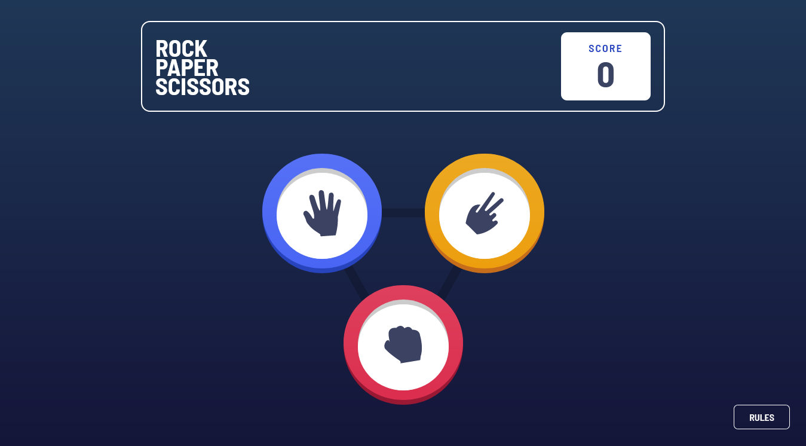

# Rock-Paper-Scissors

This is a solution to the [Rock, Paper, Scissors challenge on Frontend Mentor](https://www.frontendmentor.io/challenges/rock-paper-scissors-game-pTgwgvgH).

## Table of contents

- [Overview](#overview)
  - [The challenge](#the-challenge)
  - [Screenshot](#screenshot)
  - [Links](#links)
- [My process](#my-process)
  - [Built with](#built-with)
- [Author](#author)

## Overview

### The challenge

Users should be able to:

- View the optimal layout for the game depending on their device's screen size
- Play Rock, Paper, Scissors against the computer
- Maintain the state of the score after refreshing the browser

### Screenshot

### Links

- Solution URL: https://github.com/HediElOuni/Rock-Paper-Scissors
- Live Site URL: https://rock-paper-scissors-heo.netlify.app

## My process

### Built with

- HTML
- CSS
- JavaScript

## Author

- LinkedIn - [@HediElOuni](https://www.linkedin.com/in/hedi-el-ouni-962abb25b/)
